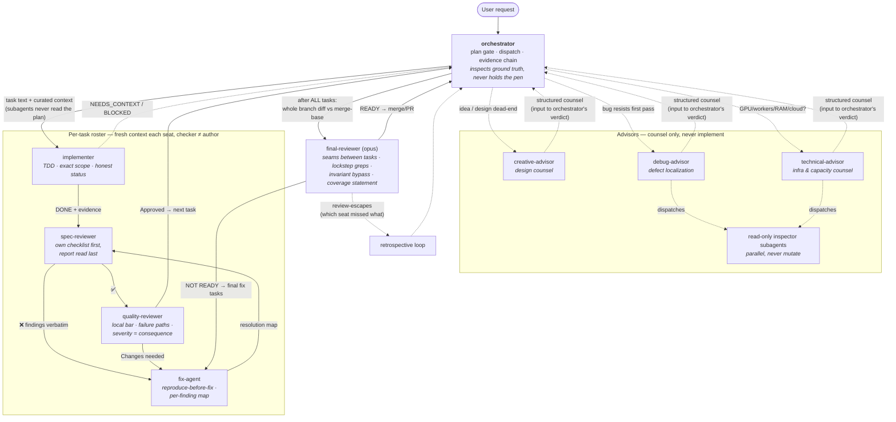

# iohan_superpowers

Nine personal Claude Code subagents that turn a single Claude session into a small, disciplined engineering team. They are **role definitions** (markdown + frontmatter), not code — Claude Code loads them as dispatchable subagents.

The system has three tiers:

- **1 orchestrator** — holds the map, the budget, the quality bar; never holds the pen.
- **3 advisors** — top-model consultation seats (design / debugging / infrastructure). They counsel; they never implement and never decide.
- **5 working seats** — the per-task execution roster (implementer → spec reviewer → quality reviewer, plus the fix agent and the final reviewer). Each file encodes its working loop, its anti-pattern gallery, and the exact report contract its consumer expects.

| Agent | Tier | Role | Model |
|---|---|---|---|
| `iohan-powers-orchestrator` | orchestrator | Two laws: inspect ground truth personally, never implement. Plan gate, roster dispatch, status protocol, layered evidence chain, retrospective loop. | `inherit` |
| `iohan-powers-creative-advisor` | advisor | Design counsel: converts desires into mechanisms, partitions trust, maps failure modes, cuts scope (YAGNI). | `opus` |
| `iohan-powers-debug-advisor` | advisor | Defect-localization counsel: reproduces with production inputs, hypothesis trees, read-only inspector subagents, root cause + evidence chain. | `opus` |
| `iohan-powers-technical-advisor` | advisor | General-purpose infrastructure counsel: 8-step thinking loop (reframe → prior → inspect → reconcile → classify → strategize → red-team → write), tiered inspection with read-only inspector subagents, capacity math, bottleneck taxonomy, runway/cloud doctrine, confidence-graded verdicts with expiry. | `opus` |
| `iohan-powers-implementer` | seat | One task exactly, strict TDD with a watched failure, recon before writing, gates pasted not summarized, honest 4-status protocol (DONE / DONE_WITH_CONCERNS / NEEDS_CONTEXT / BLOCKED). | `inherit` (dispatch `haiku` mechanical / `sonnet` integration) |
| `iohan-powers-spec-reviewer` | seat | Anti-anchored compliance check: builds its own requirement checklist from the task text BEFORE seeing the diff, reads the implementer's report LAST. Falsifiability test per requirement. Binary ✅/❌, complete enumeration. | `inherit` (dispatch `sonnet`) |
| `iohan-powers-quality-reviewer` | seat | Craft review calibrated to the codebase's own bar: failure-path read, beyond-the-diff duplication hunt, test durability, security sweep. Severity by named consequence (Critical/Important/Minor). | `inherit` (dispatch `sonnet`) |
| `iohan-powers-fix-agent` | seat | Findings list = entire scope. Reproduce-before-fix (failing test first), never weakens the test that exposed a defect, per-finding resolution map, disputes through the channel — never silently. | `inherit` (dispatch = task's implementer model) |
| `iohan-powers-final-reviewer` | seat | The only pass that can see the seams: seam matrix between tasks, whole-tree lockstep greps for rename survivors, invariant bypass trace, coverage statement, review-escapes for the retrospective. | `opus` |

---

## How it behaves — connecting the dots



The structural laws that make it work:

1. **Checker is never the author.** Every task gets a fresh implementer, then a fresh spec reviewer, then a fresh quality reviewer. Reviews are anti-anchored: the spec reviewer derives its own checklist from the task text before reading the implementer's report.
2. **Counsel is input, not verdict.** Advisors return structured counsel (verdict → mechanism → alternatives → failure modes → assumptions); the orchestrator decides. The debug and technical advisors may dispatch parallel read-only inspector subagents to gather evidence, but never mutate anything.
3. **Honest channels everywhere.** Implementers report NEEDS_CONTEXT/BLOCKED early instead of guessing; fix agents dispute findings with evidence instead of silently non-fixing; reviewers say "clean" when clean instead of manufacturing findings; the final reviewer declares what it could NOT cover.
4. **The regression net is inviolable at every seat.** No seat may weaken, skip, or delete an existing test to get to green — conflicts escalate as BLOCKED/disputed.
5. **Evidence over claims.** Gates are run by the seat that reports them, output pasted; reviews re-run them; "should work" appears nowhere.

---

## Prerequisites

### 1. Claude Code

These agents only work inside [Claude Code](https://claude.com/claude-code), Anthropic's CLI.

```bash
# macOS / Linux
curl -fsSL https://claude.com/install.sh | bash

# or via npm (needs Node 18+)
npm install -g @anthropic-ai/claude-code
```

Verify:

```bash
claude --version
```

First run prompts for login (Anthropic account or API key).

### 2. Opus access

The three advisors and the final reviewer pin `model: opus`. You need a plan/API key with Opus access (Claude Pro/Max, or Console API billing). Without it those seats fall back or error. The orchestrator and the other working seats use `inherit`, so they run on any model — and the orchestrator's model ladder (cheap for mechanical, standard for integration/reviews, top for the final review) is passed per-dispatch.

### 3. (Strongly recommended) superpowers skill suite

The orchestrator runs on the **superpowers** workflow skills (`brainstorming → writing-plans → using-git-worktrees → subagent-driven-development → requesting-code-review → finishing-a-development-branch`). It degrades gracefully if absent, but you get the full discipline only with them installed. See the [superpowers plugin](https://github.com/obra/superpowers).

### 4. (Optional) domain specialist libraries

For deeply domain-specific implementation tasks (frontend UI/UX, k8s, a specific framework), the orchestrator prefers a pre-built domain specialist over the generic implementer seat — e.g. the **voltagent** agent collections (`voltagent-lang:*` for languages/frameworks, `voltagent-infra:*` for docker/CI/k8s/terraform) — pasting the implementer contract into its dispatch prompt. Likewise, per-domain **skills** (e.g. a `fullstack-dev-skills` collection: python-pro, react-expert, test-master…) keep fleet-wide lint/type hygiene consistent when implementers load them at turn start. Both layers are optional: without them the `iohan-powers-implementer` handles all implementation, with quality dipping only on domain-idiom depth.

---

## Install

Claude Code discovers subagents from `~/.claude/agents/` (user-global) or `<project>/.claude/agents/` (project-local).

### Option A — install script (user-global)

```bash
git clone https://github.com/IohanFaustino/iohan_superpowers.git
cd iohan_superpowers
./install.sh
```

### Option B — manual copy

```bash
mkdir -p ~/.claude/agents
cp agents/iohan-powers-*.md ~/.claude/agents/
```

### Option C — symlink (stay in sync with the repo)

```bash
mkdir -p ~/.claude/agents
for f in "$PWD"/agents/iohan-powers-*.md; do
  ln -sf "$f" ~/.claude/agents/
done
```

Verify Claude Code sees them:

```bash
claude
# then in-session:
/agents
```

You should see the nine `iohan-powers-*` agents listed.

---

## Usage

In any Claude Code session:

- **"orchestrate this"** / **"be the orchestrator"** → `iohan-powers-orchestrator` runs the whole flow above, dispatching the seats itself.
- **"consult the creative advisor"** / design verdict → `iohan-powers-creative-advisor`.
- **"help me find this bug"** (after a first failed pass) → `iohan-powers-debug-advisor`.
- **"should this run on GPU? how many workers? will it fit in RAM?"** → `iohan-powers-technical-advisor`.

The five working seats (`implementer`, `spec-reviewer`, `quality-reviewer`, `fix-agent`, `final-reviewer`) are normally dispatched BY the orchestrator, not by you — but they work standalone too ("dispatch the spec reviewer on task 3 against commit abc123").

Claude also auto-routes to the orchestrator/advisors when a request matches their `description`. You don't have to name them explicitly.

---

## Updating

```bash
git pull
./install.sh   # re-copies; symlink users already in sync
```

## Layout

```
.
├── README.md
├── install.sh
└── agents/
    ├── iohan-powers-orchestrator.md
    ├── iohan-powers-creative-advisor.md
    ├── iohan-powers-debug-advisor.md
    ├── iohan-powers-technical-advisor.md
    ├── iohan-powers-implementer.md
    ├── iohan-powers-spec-reviewer.md
    ├── iohan-powers-quality-reviewer.md
    ├── iohan-powers-fix-agent.md
    └── iohan-powers-final-reviewer.md
```
